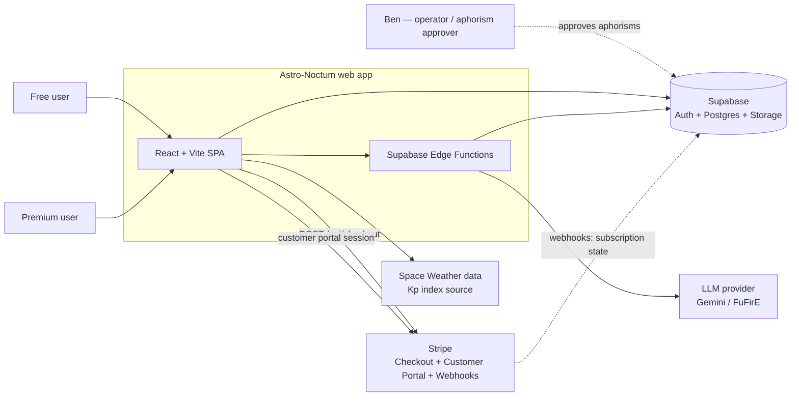
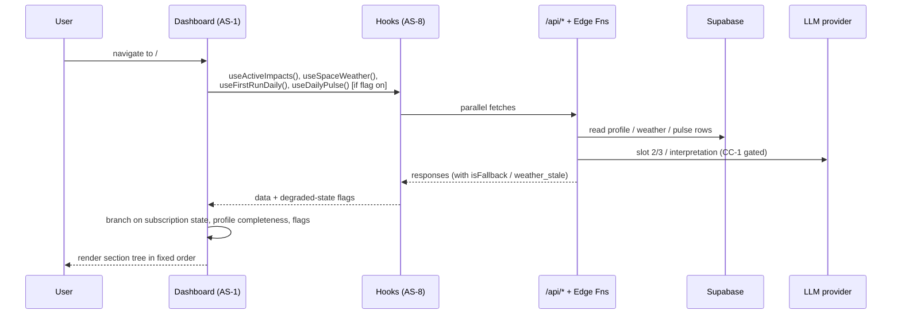
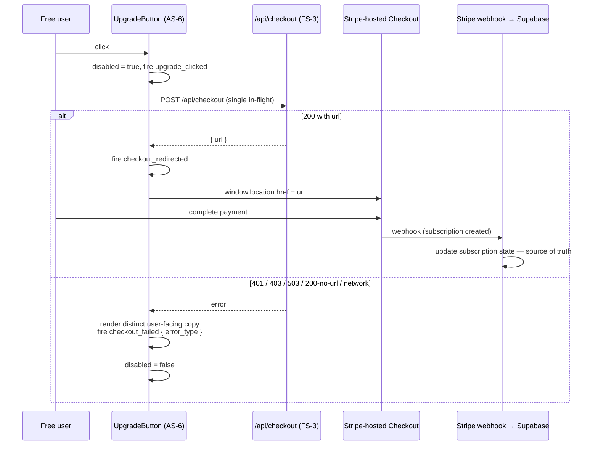

# Architecture

## 1. Purpose and Posture

This document is the architectural map of the Astro-Noctum web application as it stands at the Spec → Design transition (2026-05-13). It is **brownfield**: large portions of the system are explicitly frozen by Specification constraints and may not be redesigned within the current sprint. Specifically:

- [`CON-no-formula-changes`](../1-spec/constraints/CON-no-formula-changes.md) freezes the astrological compute layer (BaZi, Wu-Xing, Western chart, ephemeris, harmony index).
- [`CON-no-signatur-v3-rebuild`](../1-spec/constraints/CON-no-signatur-v3-rebuild.md) freezes the 3D natal-signature renderer pipeline.
- [`CON-stripe-payment-stack`](../1-spec/constraints/CON-stripe-payment-stack.md) freezes the payment architecture (`/api/checkout` → Stripe-hosted checkout → webhooks).

The role of this document is therefore not to invent the system but to (a) record what exists, (b) call out the seams where Active sprint work attaches to Frozen subsystems, and (c) make the cross-cutting concerns — GDPR, degraded-state transparency, polling discipline — explicit so they are not lost across components.

Per the Design Principle ([`CLAUDE.design.md`](CLAUDE.design.md)), the architecture introduces no component or abstraction not required by an approved requirement.

## 2. System Context

## 3. Frozen Subsystems

These subsystems are documented as black-box dependencies. Active work integrates with them via stated interfaces only.

### FS-1 Astrology Engine

- **Locations:** `src/lib/cymatics/`, `src/lib/signatur-3d/`, server-side endpoints producing BaZi pillars, Western chart positions, Wu-Xing element weights, daily harmony index, and ephemeris-derived transits.
- **Inputs:** birth date / time / place, current timestamp.
- **Outputs:** numeric astrological values consumed by all downstream surfaces — `chladniParams`, `planetWeights`, `harmony_index`, `dominant_element`, `baseCoherence`, `positiveDailyDelta`.
- **Owning constraint:** [`CON-no-formula-changes`](../1-spec/constraints/CON-no-formula-changes.md). The known Wu-Xing DE/EN-drift bug in `bazi-to-chladni.ts` is acknowledged but tracked in a separate fix-track.
- **Integration points used by Active subsystems:** consumed by AS-2, AS-3, AS-5; never modified.

### FS-2 Signature Renderer Pipeline

- **Locations:** `src/components/signatur-3d/SignatureSphere3D.tsx`, `src/components/signatur-renderer/SignaturRenderer.tsx`, `src/lib/cymatics/bazi-to-chladni.ts`, `src/lib/signatur-3d/*`, standalone page `src/pages/SignaturPage.tsx`.
- **Inputs:** `userId`, `labels`, `chladniParams` (`ChladniParams`), `planetWeights` (`Record<PlanetName, number>`).
- **Outputs:** WebGL-rendered 3D natal-signature sphere; `CymaticsFallback` when `chladniParams === undefined`.
- **Owning constraint:** [`CON-no-signatur-v3-rebuild`](../1-spec/constraints/CON-no-signatur-v3-rebuild.md). Internals (shaders, geometry, material) out of scope. Only the integration surface (anchor card, error boundary, perf guard) is in scope.
- **Integration points used by Active subsystems:** AS-5 wraps it with `SectionErrorBoundary` and gates inline embedding behind a measured-perf decision.

### FS-3 Stripe Checkout Stack

- **Locations (frontend-visible):** `POST /api/checkout` (server route in `server.mjs`), Stripe-hosted Checkout (`https://checkout.stripe.com/...`), Stripe Customer Portal session URL endpoint (backend), Stripe webhooks landing at Supabase.
- **Contract:** `POST /api/checkout` → `200 { url: string }` on success; standardized error codes 401 / 403 / 503 / 200-no-url. Webhooks are the **sole** source of truth for subscription state.
- **Owning constraint:** [`CON-stripe-payment-stack`](../1-spec/constraints/CON-stripe-payment-stack.md). Replacement, custom checkout UI, or alternative payment provider out of scope.
- **Integration points used by Active subsystems:** AS-6 calls `/api/checkout`; AS-7 retrieves Customer Portal session URLs.

## 4. Active Subsystems

### AS-1 Dashboard Composition Layer

- **Responsibility:** orchestrate dashboard section order, propagate state from data hooks to section components, gate sections by feature flag and subscription state, own tour-overlay visibility.
- **Files:** `src/components/Dashboard.tsx` (composition root), section components under `src/components/dashboard/`.
- **Section order** (per [REQ-USA-dashboard-section-order](../1-spec/requirements/REQ-USA-dashboard-section-order.md), draft): TagespulsCard (flag-gated) → DailyChartHero → Signatur Anchor → Active Influences → Daily Impulse / Modal → Agents → Blueprint.
- **Requirements satisfied:** [REQ-F-tour-overlay-state](../1-spec/requirements/REQ-F-tour-overlay-state.md), [REQ-USA-dashboard-section-order](../1-spec/requirements/REQ-USA-dashboard-section-order.md), [REQ-USA-cta-singular](../1-spec/requirements/REQ-USA-cta-singular.md) (free/premium switch), [REQ-USA-signature-first-viewport](../1-spec/requirements/REQ-USA-signature-first-viewport.md) (section position).
- **Depends on:** AS-2, AS-4, AS-5, AS-6, AS-7, AS-8.
- **Key interfaces:** props down to section components; never inlines feature-specific logic (kept in subsystems).

### AS-2 DailyChart UI

- **Responsibility:** render the daily harmony chart and impulse text. Distinguish live, fallback, and unavailable states. Show profile-completion CTA when birth data missing.
- **Files:** `src/components/dashboard/DailyChartHero.tsx`, `src/hooks/useActiveImpacts.ts`, `src/hooks/useFirstRunDaily.ts`.
- **Requirements satisfied:** [REQ-USA-fallback-indicator](../1-spec/requirements/REQ-USA-fallback-indicator.md), [REQ-USA-profile-incomplete-cta](../1-spec/requirements/REQ-USA-profile-incomplete-cta.md), [REQ-F-impact-active-contract](../1-spec/requirements/REQ-F-impact-active-contract.md).
- **Depends on:** FS-1 (via `/api/impact/active`), AS-8 (polling discipline).
- **Key interfaces:** `isFallback` prop derived from `dailyData.meta.engine_version === 'v1-local-fallback'`; coherence values sourced exclusively from a single `useActiveImpacts()` call.

### AS-3 Daily Pulse Engine (Tagespuls Neu-Architektur)

- **Responsibility:** produce a deterministic per-(userId, date, locale) daily pulse comprising mode classification, aphorism (slot 1), LLM-generated bridge (slot 2) and action impulse (slot 3), and a Council-of-Six figure set. Generate cached per-figure interpretations on demand.
- **Locations:** Supabase Edge Functions `supabase/functions/daily-pulse/` (GET) and `supabase/functions/daily-interpretation/` (POST); supporting code under `apps/tagespuls_package/packages/`.
- **Persistence:** `aphorisms`, `daily_pulses`, `daily_interpretations`, `cosmic_weather_snapshots`, `user_astro_profiles`, `aphorism_usage_events` (data-model phase will detail schemas).
- **Selection algorithm:** top-5 aphorisms by `quality_rating` for the resolved mode → `simpleHash(userId + date + mode) % 5`. Deterministic.
- **Requirements satisfied:** [REQ-F-daily-pulse-determinism](../1-spec/requirements/REQ-F-daily-pulse-determinism.md), [REQ-F-council-interpretation-cache](../1-spec/requirements/REQ-F-council-interpretation-cache.md), [REQ-F-aphorism-approval-gate](../1-spec/requirements/REQ-F-aphorism-approval-gate.md), [REQ-F-tagespuls-feature-flag](../1-spec/requirements/REQ-F-tagespuls-feature-flag.md).
- **Depends on:** FS-1 (harmony index for mode classification), LLM provider (slot 2/3), CC-1 (LLM-purpose consent check).
- **Aphorism approval gate** (per [`CON-aphorisms-human-approved`](../1-spec/constraints/CON-aphorisms-human-approved.md)): only `status = 'approved'` rows are read by the engine; the engine is the runtime checkpoint, not the gate (the gate is operational).

### AS-4 TagespulsCard Surface

- **Responsibility:** render the new Tagespuls UI in two phases. Phase 1 = aphorism + Council-of-Six selection moment. Phase 2 = chosen-figure interpretation with back affordance. Empty-state for incomplete profiles, loading skeleton, fallback marker.
- **Files:** `src/components/dashboard/TagespulsCard.tsx`, `src/hooks/useDailyPulse.ts`.
- **Requirements satisfied:** [REQ-USA-tagespuls-card-phases](../1-spec/requirements/REQ-USA-tagespuls-card-phases.md), [REQ-F-useDailyPulse-null-guard](../1-spec/requirements/REQ-F-useDailyPulse-null-guard.md).
- **Depends on:** AS-3 (data), AS-1 (composition, flag gate), CC-2 (fallback marker pattern).
- **Feature flag:** `tagespuls_neu_v1` (off → card not rendered; existing dashboard unchanged).
- **Empty-state behavior** (per REQ-F-useDailyPulse-null-guard): `birthData === null` → hook returns `{ pulse: null, isFallback: false }` explicitly; card renders profile-completion CTA matching AS-2's pattern. No silent hook exit.

### AS-5 Signature Anchor Layer

- **Responsibility:** make FS-2 reachable from the dashboard's first viewport for completed profiles; render an explicit empty state for incomplete profiles; isolate renderer failures from the rest of the dashboard.
- **Files:** new `src/components/dashboard/SignaturAnchorCard.tsx`, existing `src/components/SectionErrorBoundary.tsx`, existing `NatalSignaturStatic` for the preview surface.
- **Default form** (per [REQ-PERF-signature-no-direct-embed](../1-spec/requirements/REQ-PERF-signature-no-direct-embed.md), draft): preview card with CTA to `/signatur`, no inline WebGL in dashboard. Inline embedding is opt-in and per-decision after performance measurement.
- **Requirements satisfied:** [REQ-USA-signature-first-viewport](../1-spec/requirements/REQ-USA-signature-first-viewport.md), [REQ-USA-signature-empty-state](../1-spec/requirements/REQ-USA-signature-empty-state.md), [REQ-REL-signature-error-isolation](../1-spec/requirements/REQ-REL-signature-error-isolation.md), [REQ-PERF-signature-no-direct-embed](../1-spec/requirements/REQ-PERF-signature-no-direct-embed.md).
- **Depends on:** FS-2 (target of navigation, optional inline render), FS-1 (dominant element label).

### AS-6 Upgrade Funnel

- **Responsibility:** present exactly one primary upgrade CTA to free users (zero to premium); guarantee a single `/api/checkout` request per click; redirect on success; render distinct, actionable error messages per error class.
- **Files:** `src/components/UpgradeButton.tsx` (sole trigger), `src/components/dashboard/AgentSection.tsx` (lock-hint only), CTA inventory in `Dashboard.tsx` comment or `docs/cta-inventory.md`.
- **CTA classification taxonomy** (per [REQ-USA-cta-singular](../1-spec/requirements/REQ-USA-cta-singular.md)):
  - `keep_primary` — the single primary CTA (free user only)
  - `convert_to_lock_hint` — visual lock indicator, no checkout call
  - `remove` — redundant, deleted
  - `modal_only` — allowed inside modals, doesn't count toward first-viewport limit unless auto-opened
  - `premium_only_manage` — `ManageSubscription` (AS-7), premium only
- **Error categories** (per [REQ-USA-checkout-error-categories](../1-spec/requirements/REQ-USA-checkout-error-categories.md)): not-logged-in, 401, 403, 503, 200-no-url, network — each with distinct locale-aware copy and a `checkout_failed` analytics event carrying `error_type`.
- **Requirements satisfied:** [REQ-USA-cta-singular](../1-spec/requirements/REQ-USA-cta-singular.md), [REQ-F-checkout-single-trigger](../1-spec/requirements/REQ-F-checkout-single-trigger.md), [REQ-F-checkout-stripe-redirect](../1-spec/requirements/REQ-F-checkout-stripe-redirect.md), [REQ-USA-checkout-error-categories](../1-spec/requirements/REQ-USA-checkout-error-categories.md), [REQ-F-agent-card-no-checkout](../1-spec/requirements/REQ-F-agent-card-no-checkout.md).
- **Depends on:** FS-3 (target), CC-1 (analytics PII-free for checkout events).

### AS-7 ManageSubscription Surface

- **Responsibility:** premium-only billing UI; show current plan, next renewal date, masked payment method; delegate state-changing operations to Stripe Customer Portal via backend-issued session URL.
- **Files:** `src/components/ManageSubscription.tsx`; backend session-URL endpoint (existing or to-be-added on the server route layer).
- **Requirements satisfied:** [REQ-F-manage-subscription](../1-spec/requirements/REQ-F-manage-subscription.md).
- **Depends on:** FS-3 (Customer Portal), CC-1 (GDPR — billing data DPA lives with Stripe).
- **Free-user fallback:** if a free user lands here, renders empty / not-applicable state and offers the single AS-6 upgrade CTA — does not become a parallel CTA path.

### AS-8 Polling and Data Sources Layer

- **Responsibility:** keep client-side polling within the budget; enforce single-poller-per-source per dashboard mount; pause or extend intervals when document is hidden.
- **Hooks owned:** `useActiveImpacts`, `useSignaturSignal`, `useSpaceWeather`, `useDailyPulse` (AS-3 client), `useFirstRunDaily` (AS-2 first-run).
- **Discipline rules** (per [`CON-greenops-polling-budget`](../1-spec/constraints/CON-greenops-polling-budget.md)):
  - Aggregate ceiling: ~1000 req / 15 min / dashboard mount across all hooks.
  - `useSignaturSignal`: baseline 15 000 ms, hidden ≥60 000 ms or paused.
  - `useSpaceWeather`: called once in `Dashboard.tsx`, passed via prop to `MagnetsturmKarte` (which becomes purely presentational).
  - Visibility-restore: at most one immediate refresh per visibility transition.
- **Requirements satisfied:** [REQ-PERF-polling-budget](../1-spec/requirements/REQ-PERF-polling-budget.md), [REQ-PERF-polling-visibility](../1-spec/requirements/REQ-PERF-polling-visibility.md), [REQ-MNT-single-poller-per-source](../1-spec/requirements/REQ-MNT-single-poller-per-source.md).

## 5. Cross-Cutting Concerns

### CC-1 Consent and GDPR Layer

A horizontal concern that touches AS-3, AS-6, AS-7, AS-8, and any future data-collection surface.

- **Consent records store** — append-only Supabase table keyed by `(user_id, purpose, consent_text_version)` with `granted_at` and optional `revoked_at`. Purposes at minimum: astrological derivation, analytics, billing (lawful basis: contract, not consent), LLM interpretation. ([REQ-COMP-consent-record](../1-spec/requirements/REQ-COMP-consent-record.md))
- **Data export endpoint** — authenticated, rate-limited, produces JSON containing birth profile, daily pulses, daily interpretations, aphorism usage events, consent records (active + revoked), local subscription metadata + Stripe-pointer. ([REQ-COMP-data-export](../1-spec/requirements/REQ-COMP-data-export.md))
- **RTBF deletion job** — purges per-user rows across `user_astro_profiles`, `daily_pulses`, `daily_interpretations`, `aphorism_usage_events`, consent records (or replaces with redacted tombstone); calls Stripe customer-deletion API; documented backup-rotation propagation; target window 30 days. ([REQ-COMP-rtbf](../1-spec/requirements/REQ-COMP-rtbf.md))
- **Analytics PII gateway** — central event-emit function that strips/hashes `user_id` and rejects payloads containing `email`, birth fields, `ip_address`, or Stripe IDs. Single chokepoint protects every event emitter. ([REQ-COMP-analytics-pii-free](../1-spec/requirements/REQ-COMP-analytics-pii-free.md))
- **LLM-purpose-consent check** — gateway around any call site that sends personal data to the LLM provider; rejects calls whose purpose lacks an active consent record. Cached responses from before revocation may still display; regeneration blocked. ([REQ-COMP-llm-purpose-consent](../1-spec/requirements/REQ-COMP-llm-purpose-consent.md))
- **Privacy notice page** — public, footer-linked, lists controller identity, processing purposes + lawful bases, retention periods, sub-processors (Stripe, Supabase, LLM provider), data-subject rights and exercise channels, supervisory-authority info, last-updated. ([REQ-COMP-privacy-notice](../1-spec/requirements/REQ-COMP-privacy-notice.md))

### CC-2 Degraded-State Transparency

Per [`CON-degraded-state-transparency`](../1-spec/constraints/CON-degraded-state-transparency.md), every data-consuming component must distinguish three states — live, fallback / generic, unavailable — and render a distinct affordance for each. Hooks that substitute defaults surface that substitution in their return shape (`isFallback`, `weather_stale`, `isUnavailable`).

Reference implementation: TASK-D2 fallback indicator in `DailyChartHero` (`data-testid="fallback-indicator"`, low-opacity caption). Any new data-consuming component must follow this pattern.

### CC-3 Feature Flags

- `tagespuls_neu_v1` — gates AS-4 (TagespulsCard). Default off until aphorism gate ([`CON-aphorisms-human-approved`](../1-spec/constraints/CON-aphorisms-human-approved.md)) satisfied and Phase T deployed.
- `daily_modal_v1` — already in use; gates day-detail modal accessibility.

Flags are read by AS-1 (Dashboard) and propagated to section components as boolean props. Context-based distribution is avoided to keep traceability simple.

## 6. Component Interactions

### 6a. Dashboard mount sequence

### 6b. Upgrade funnel flow

## 7. External Dependencies

| Dependency | Purpose | Criticality | Fallback behavior | GDPR role |
|------------|---------|-------------|-------------------|-----------|
| Supabase (Auth, Postgres, Edge Functions, Storage) | Primary backend for users, profiles, daily pulses, consent records | Critical — no fallback | Outage → degraded-state markers throughout (CC-2); auth-gated surfaces become inaccessible | Sub-processor (DPA required) |
| Stripe (Checkout, Customer Portal, Webhooks) | Payment processing; sole source of truth for subscription state | Critical for revenue | 503 error category surfaced in AS-6; checkout disabled with clear message | Sub-processor for billing (contract basis under Art. 6(1)(b)) |
| LLM provider (Gemini / FuFirE) | Generate slot 2 / slot 3 (AS-3) and Council interpretation | Important; fallback exists | Max 2 retries → AS-3 returns fallback slot 2/3 with `isFallback: true` | Sub-processor; consent-gated via CC-1 |
| Space Weather data source (Kp index) | Driver strip in DailyChartHero | Optional | Missing value → driver strip shows `—`, never `0` | None (no personal data) |

## 8. Performance Characteristics

- **Polling budget:** ~1000 req / 15 min / dashboard mount aggregate ceiling, per [`CON-greenops-polling-budget`](../1-spec/constraints/CON-greenops-polling-budget.md). Per-hook intervals declared in AS-8.
- **Visibility-aware:** intervals extend to ≥60 s or pause when `document.visibilityState === 'hidden'`; one immediate refresh on visibility-restore.
- **Single poller per source:** any external data source has exactly one hook per dashboard mount; consumer components receive data via props.
- **No inline WebGL in dashboard:** AS-5 defaults to preview card; inline `SignaturRenderer` requires measured performance acceptance and a recorded `DEC-*`.
- **Loading discipline:** every async-loading section renders a skeleton, never a blank or `null`.

## 9. Constraint Compliance

| Constraint | How the architecture respects it |
|------------|----------------------------------|
| [CON-no-formula-changes](../1-spec/constraints/CON-no-formula-changes.md) | Astrology compute is FS-1 (frozen). All Active subsystems consume its outputs through documented endpoints; no Active subsystem includes derivation code. |
| [CON-stripe-payment-stack](../1-spec/constraints/CON-stripe-payment-stack.md) | FS-3 frozen. AS-6 calls `/api/checkout` and `window.location.href`s the returned Stripe URL; AS-7 obtains Stripe Customer Portal session URLs from the backend. Subscription state read from Stripe webhooks landing in Supabase — never invented client-side. |
| [CON-no-signatur-v3-rebuild](../1-spec/constraints/CON-no-signatur-v3-rebuild.md) | FS-2 frozen. AS-5 wraps it with `SectionErrorBoundary` and a preview-card pattern; no shader, geometry, or material-pipeline changes. |
| [CON-aphorisms-human-approved](../1-spec/constraints/CON-aphorisms-human-approved.md) | AS-3 reads only `status = 'approved'` rows. The approval transition is operational (Ben edits markdown → build pipeline → seed). No agent path produces or promotes approved aphorisms. |
| [CON-greenops-polling-budget](../1-spec/constraints/CON-greenops-polling-budget.md) | AS-8 codifies the discipline; new polling hooks declare interval, hidden-state behavior, and event-trigger semantics before merge. |
| [CON-degraded-state-transparency](../1-spec/constraints/CON-degraded-state-transparency.md) | CC-2. Every data-consuming component renders distinct affordances for live / fallback / unavailable; hooks surface the substitution in their return shape. |
| [CON-gdpr-applies](../1-spec/constraints/CON-gdpr-applies.md) | CC-1. Every personal-data collection or processing path attaches to one of the six CC-1 mechanisms (consent record, export, RTBF, analytics gateway, LLM gateway, privacy notice). |

## 10. Assumption Risks

| Assumption | Risk | Design implication |
|------------|------|--------------------|
| [ASM-supabase-fits-personal-data-scale](../1-spec/assumptions/ASM-supabase-fits-personal-data-scale.md) | **High** | CC-1 is built on Supabase. If RTBF cascade timing, Art. 20 export performance, EU residency, or DPA suitability fail to hold, the entire CC-1 layer relocates. Design Phase verification (read Supabase region + DPA, simulate RTBF cascade across 6 tables) recommended before Code phase commits. |
| [ASM-mobile-webgl-availability](../1-spec/assumptions/ASM-mobile-webgl-availability.md) | Medium | AS-5 default form (preview card, no inline WebGL) already hedges. Inline embedding decision deferred until measured. |
| [ASM-llm-determinism-acceptable](../1-spec/assumptions/ASM-llm-determinism-acceptable.md) | Medium | AS-3 slot 2/3 and `daily-interpretation` accept some output variance because cached results stabilize per (user, date, daily_pulse_id, archetype). If user-perceived inconsistency appears, the cache is the lever. |
| [ASM-german-primary-user-base](../1-spec/assumptions/ASM-german-primary-user-base.md) | Medium | UI copy primary in DE with EN secondary; all CC-1 surfaces (privacy notice, consent text) authored in DE-first. |
| [ASM-stripe-uptime-acceptable](../1-spec/assumptions/ASM-stripe-uptime-acceptable.md) | Low | AS-6 error category 503 surfaces Stripe outage; no alternate provider in scope. |

## 11. Requirement Coverage

| Requirement | Owning subsystem |
|-------------|------------------|
| [REQ-F-tour-overlay-state](../1-spec/requirements/REQ-F-tour-overlay-state.md) | AS-1 |
| [REQ-USA-fallback-indicator](../1-spec/requirements/REQ-USA-fallback-indicator.md) | AS-2 + CC-2 |
| [REQ-USA-profile-incomplete-cta](../1-spec/requirements/REQ-USA-profile-incomplete-cta.md) | AS-2 |
| [REQ-F-impact-active-contract](../1-spec/requirements/REQ-F-impact-active-contract.md) | AS-2 |
| [REQ-USA-dashboard-section-order](../1-spec/requirements/REQ-USA-dashboard-section-order.md) (draft) | AS-1 |
| [REQ-USA-signature-first-viewport](../1-spec/requirements/REQ-USA-signature-first-viewport.md) | AS-5 (position via AS-1) |
| [REQ-USA-signature-empty-state](../1-spec/requirements/REQ-USA-signature-empty-state.md) | AS-5 |
| [REQ-REL-signature-error-isolation](../1-spec/requirements/REQ-REL-signature-error-isolation.md) | AS-5 |
| [REQ-PERF-signature-no-direct-embed](../1-spec/requirements/REQ-PERF-signature-no-direct-embed.md) (draft) | AS-5 |
| [REQ-F-aphorism-approval-gate](../1-spec/requirements/REQ-F-aphorism-approval-gate.md) (draft) | AS-3 |
| [REQ-F-daily-pulse-determinism](../1-spec/requirements/REQ-F-daily-pulse-determinism.md) (draft) | AS-3 |
| [REQ-F-council-interpretation-cache](../1-spec/requirements/REQ-F-council-interpretation-cache.md) (draft) | AS-3 |
| [REQ-F-useDailyPulse-null-guard](../1-spec/requirements/REQ-F-useDailyPulse-null-guard.md) (draft) | AS-4 |
| [REQ-F-tagespuls-feature-flag](../1-spec/requirements/REQ-F-tagespuls-feature-flag.md) (draft) | AS-4 + CC-3 |
| [REQ-USA-tagespuls-card-phases](../1-spec/requirements/REQ-USA-tagespuls-card-phases.md) (draft) | AS-4 |
| [REQ-USA-cta-singular](../1-spec/requirements/REQ-USA-cta-singular.md) | AS-1 + AS-6 |
| [REQ-F-checkout-single-trigger](../1-spec/requirements/REQ-F-checkout-single-trigger.md) | AS-6 |
| [REQ-F-checkout-stripe-redirect](../1-spec/requirements/REQ-F-checkout-stripe-redirect.md) | AS-6 (target: FS-3) |
| [REQ-USA-checkout-error-categories](../1-spec/requirements/REQ-USA-checkout-error-categories.md) | AS-6 |
| [REQ-F-agent-card-no-checkout](../1-spec/requirements/REQ-F-agent-card-no-checkout.md) | AS-6 |
| [REQ-F-manage-subscription](../1-spec/requirements/REQ-F-manage-subscription.md) | AS-7 |
| [REQ-PERF-polling-budget](../1-spec/requirements/REQ-PERF-polling-budget.md) (draft) | AS-8 |
| [REQ-PERF-polling-visibility](../1-spec/requirements/REQ-PERF-polling-visibility.md) (draft) | AS-8 |
| [REQ-MNT-single-poller-per-source](../1-spec/requirements/REQ-MNT-single-poller-per-source.md) (draft) | AS-8 |
| [REQ-COMP-consent-record](../1-spec/requirements/REQ-COMP-consent-record.md) | CC-1 |
| [REQ-COMP-data-export](../1-spec/requirements/REQ-COMP-data-export.md) | CC-1 |
| [REQ-COMP-rtbf](../1-spec/requirements/REQ-COMP-rtbf.md) | CC-1 |
| [REQ-COMP-analytics-pii-free](../1-spec/requirements/REQ-COMP-analytics-pii-free.md) | CC-1 + AS-6 + AS-8 |
| [REQ-COMP-llm-purpose-consent](../1-spec/requirements/REQ-COMP-llm-purpose-consent.md) | CC-1 + AS-3 |
| [REQ-COMP-privacy-notice](../1-spec/requirements/REQ-COMP-privacy-notice.md) | CC-1 |
| [REQ-SEC-edge-function-auth](../1-spec/requirements/REQ-SEC-edge-function-auth.md) | AS-3 |
| [REQ-SEC-checkout-rate-limit](../1-spec/requirements/REQ-SEC-checkout-rate-limit.md) | AS-6 + FS-3 boundary |
| [REQ-SEC-export-authz](../1-spec/requirements/REQ-SEC-export-authz.md) | CC-1 |
| [REQ-SEC-rtbf-authz](../1-spec/requirements/REQ-SEC-rtbf-authz.md) | CC-1 |
| [REQ-SEC-llm-gateway-hardening](../1-spec/requirements/REQ-SEC-llm-gateway-hardening.md) | CC-1 + AS-3 |
| [REQ-SEC-portal-session-tokens](../1-spec/requirements/REQ-SEC-portal-session-tokens.md) | AS-7 |
| [REQ-SEC-tls-everywhere](../1-spec/requirements/REQ-SEC-tls-everywhere.md) | Deploy / infrastructure layer (cross-cutting) |
| [REQ-SEC-no-secrets-in-client](../1-spec/requirements/REQ-SEC-no-secrets-in-client.md) | Build / deploy pipeline (cross-cutting) |
| [REQ-SEC-auth-session-storage](../1-spec/requirements/REQ-SEC-auth-session-storage.md) | CC-1 (Supabase Auth integration) |

All 28 Approved requirements (19 prior + 9 REQ-SEC elicited 2026-05-13) are covered by at least one subsystem or cross-cutting concern. The 11 Draft requirements are also assigned (status will be reviewed during Refinement once design lands).

## 12. Open Gaps

- **REQ-SEC requirements elicited (2026-05-13).** The 6 architectural seams previously identified now have explicit security requirements attached (see §11). 3 additional cross-cutting REQ-SEC items (`REQ-SEC-tls-everywhere`, `REQ-SEC-no-secrets-in-client`, `REQ-SEC-auth-session-storage`) extend coverage to transport security, secret management, and session storage. **This gap is closed.**
- **`data-model.md` drafted (2026-05-13).** 11 entities across operational / reference / compliance-state groups, ER diagram, RTBF cascade specification, deletion-job state machine, analytics event schemas, 8 cross-entity invariants. See [`data-model.md`](data-model.md).
- **`api-design.md` drafted (2026-05-13).** 13 endpoints (3 frozen + 10 active) with auth, request/response shapes, error envelope, rate limits, and GDPR posture. See [`api-design.md`](api-design.md).
- **STK-user-premium without direct goal source-link** — **conceptually resolved by [`data-model.md`](data-model.md) §6** (premium = `subscription_state.tier`, not a structurally distinct stakeholder). Optional follow-up: formalize by updating STK-user-premium description in `1-spec/stakeholders.md` to note its relationship to STK-user-free.
