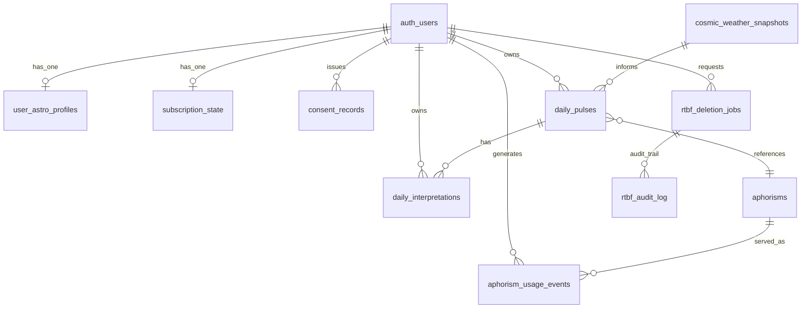

# Data Model

## 1. Purpose and Scope

This document is the conceptual data model for Astro-Noctum. It defines entity intent, relationships, lifecycles, and GDPR-relevant invariants implied by [`architecture.md`](architecture.md) and the approved requirements. It is **design-level**: full SQL column types, indexes, RLS policies, and migration ordering are deferred to Code-phase migration files. Where a draft schema exists at `apps/tagespuls_package/packages/db/schema.sql` (per the active dev brief), the eventual migration is expected to align with the entities defined here.

The model is minimal: only entities required by an approved requirement or by an architectural subsystem appear here. Speculative entities for hypothetical future features are excluded per the Design Principle.

## 2. Entity Catalog

Three groups: **operational** entities hold per-user astrological data; **reference** entities hold system-managed source data; **compliance / state** entities hold GDPR machinery and Stripe-mirror state.

### 2.1 Operational entities (per-user)

#### `user_astro_profiles`

- **Purpose:** the user's birth data — input to the Astrology Engine (FS-1) and Daily Pulse Engine (AS-3).
- **Key attributes:** `user_id` (PK, FK → `auth.users`), `birth_date`, `birth_time`, `birth_place` (canonical place name + lat/lng or place identifier), `timezone`, `locale`, `created_at`, `updated_at`.
- **Identity:** 1:1 with the authenticated user.
- **Lifecycle:** created on first profile completion; updatable by the user; row purged by RTBF.
- **Retention:** lifetime of the user account; deleted within the RTBF target window after a confirmed erasure request.
- **Backing requirements:** [REQ-USA-profile-incomplete-cta](../1-spec/requirements/REQ-USA-profile-incomplete-cta.md), [REQ-F-useDailyPulse-null-guard](../1-spec/requirements/REQ-F-useDailyPulse-null-guard.md), [REQ-COMP-rtbf](../1-spec/requirements/REQ-COMP-rtbf.md), [REQ-SEC-edge-function-auth](../1-spec/requirements/REQ-SEC-edge-function-auth.md).

#### `daily_pulses`

- **Purpose:** cache deterministic daily-pulse output per (user, date, locale) — primary output of AS-3.
- **Key attributes:** `id` (UUID, surrogate), `user_id` (FK), `date` (DATE), `locale` (`de`|`en`), `mode` (`pulse`|`trace`|`spannung`), `intensity` (numeric), `harmony_index` (numeric), `aphorism_id` (FK → `aphorisms`), `slot_2` (text — LLM-generated bridge), `slot_3` (text — LLM-generated action impulse), `council_set` (jsonb — six Council figures with metadata), `engine_version` (e.g., `v1` or `v1-local-fallback`), `weather_stale` (bool), `is_fallback` (bool), `created_at`.
- **Identity:** surrogate `id`; unique on `(user_id, date, locale)`.
- **Lifecycle:** INSERTed on first GET per (user, date, locale); never updated — deterministic regeneration would produce the same row per [REQ-F-daily-pulse-determinism](../1-spec/requirements/REQ-F-daily-pulse-determinism.md); row purged by RTBF.
- **Retention:** indefinite until RTBF (history is a product feature).
- **Backing requirements:** REQ-F-daily-pulse-determinism, [REQ-F-aphorism-approval-gate](../1-spec/requirements/REQ-F-aphorism-approval-gate.md) (only approved aphorisms referenced), [REQ-USA-fallback-indicator](../1-spec/requirements/REQ-USA-fallback-indicator.md) (consumes `engine_version` and `is_fallback`), [REQ-COMP-rtbf](../1-spec/requirements/REQ-COMP-rtbf.md).

#### `daily_interpretations`

- **Purpose:** cache per-figure LLM interpretation per [REQ-F-council-interpretation-cache](../1-spec/requirements/REQ-F-council-interpretation-cache.md). Prevents duplicate LLM calls for the same (user, day, figure).
- **Key attributes:** `id` (UUID), `user_id` (FK), `daily_pulse_id` (FK → `daily_pulses`), `selected_archetype_key` (enum: `sonne`|`mond`|`aszendent`|`day_master`|`jahrestier`|`wuxing_dom`), `locale`, `text`, `llm_model` (provider+version identifier), `created_at`.
- **Identity:** surrogate `id`; unique on `(daily_pulse_id, selected_archetype_key, locale)`.
- **Lifecycle:** INSERTed on first POST per (pulse, archetype, locale); never updated; purged by RTBF.
- **Retention:** indefinite until RTBF.
- **Backing requirements:** REQ-F-council-interpretation-cache, [REQ-COMP-llm-purpose-consent](../1-spec/requirements/REQ-COMP-llm-purpose-consent.md) (write gated by active LLM-purpose consent), REQ-COMP-rtbf.

#### `cosmic_weather_snapshots`

- **Purpose:** daily snapshot of cosmic-weather data (planetary positions, transit aspects, Kp index, sunspot count, derived signals) — input to AS-3 and AS-2.
- **Key attributes:** `date` (PK), `snapshot` (jsonb), `source_kp` (string identifier of Kp source), `created_at`.
- **Identity:** PK `date`. Not per-user.
- **Lifecycle:** INSERTed by a scheduled job on the boundary of the local day; never updated. Late-arriving data → a fresh snapshot is inserted under a different date or the row is left as-is and consumers surface `weather_stale: true`.
- **Retention:** indefinite (no PII).
- **Backing requirements:** [REQ-F-impact-active-contract](../1-spec/requirements/REQ-F-impact-active-contract.md) (driver-strip data source consistency), indirectly REQ-F-daily-pulse-determinism (deterministic snapshot is part of input).

#### `aphorism_usage_events`

- **Purpose:** record which aphorism was served to which user on which date — the cooldown filter in aphorism selection (per-aphorism `cooldown_days`) reads this.
- **Key attributes:** `id` (UUID), `user_id` (FK), `aphorism_id` (FK), `date`, `served_at`.
- **Identity:** surrogate `id`; unique on `(user_id, aphorism_id, date)`.
- **Lifecycle:** INSERTed when AS-3 selects an aphorism for a `daily_pulses` row; never updated; purged by RTBF (it is per-user data).
- **Retention:** indefinite until RTBF.
- **Backing requirements:** REQ-F-daily-pulse-determinism (cooldown is part of the deterministic selection pipeline), REQ-COMP-rtbf.

### 2.2 Reference entities (system)

#### `aphorisms`

- **Purpose:** the system's approved aphorism pool consumed by AS-3.
- **Key attributes:** `id` (string PK, e.g., `aph-rilke-001`), `status` (`draft`|`approved` — only `approved` rows are read at runtime, per CON-aphorisms-human-approved), `text_de`, `text_en`, `text_original` (nullable), `author`, `work`, `year`, `original_language`, `translator_de`, `translator_en`, `copyright`, `attribution_status`, `attribution_note`, `mode_tags` (array — at least one of `pulse`|`trace`|`spannung`), `tone_tags` (array), `element_affinity` (array), `figure_affinity` (array), `season_affinity` (array), `word_count_de`, `word_count_en`, `quality_rating` (1–5), `cooldown_days` (default 30), `created_at`, `updated_at`.
- **Identity:** PK `id` (stable string derived from the source markdown filename).
- **Lifecycle:** seeded from the operator-authored `aphorisms.json` build output ([CON-aphorisms-human-approved](../1-spec/constraints/CON-aphorisms-human-approved.md)); the `status` transition is operational (Ben edits markdown → build pipeline rebuilds `aphorisms.json` → seed script upserts). Rows are never auto-deleted; explicit deprecation flips `status` to `draft` so AS-3 stops serving them.
- **Retention:** indefinite (no PII; attribution-bearing system data).
- **Backing requirements:** [REQ-F-aphorism-approval-gate](../1-spec/requirements/REQ-F-aphorism-approval-gate.md).

### 2.3 Compliance and state entities

#### `consent_records` (append-only)

- **Purpose:** persist user consent per processing purpose with version + timestamp.
- **Key attributes:** `id` (UUID), `user_id` (FK), `purpose` (enum: `astrological_derivation` | `analytics` | `billing` | `llm_interpretation`), `consent_text_version` (semver-style string), `lawful_basis` (enum: `consent` | `contract`), `granted_at`, `revoked_at` (nullable), `affirmation_method` (e.g., `explicit_checkbox_v1`), `metadata` (jsonb — UI surface, locale, etc.).
- **Identity:** surrogate `id`.
- **Lifecycle:** INSERT-only. Re-grant after revocation = new row. Text-version bump = new row required before continued processing under updated terms. Purged by RTBF (history retained until then).
- **Retention:** lifetime of account; revoked rows retained as audit context; all rows purged on RTBF execution.
- **Backing requirements:** [REQ-COMP-consent-record](../1-spec/requirements/REQ-COMP-consent-record.md), [REQ-COMP-llm-purpose-consent](../1-spec/requirements/REQ-COMP-llm-purpose-consent.md) (LLM gateway reads active consent for the purpose).

#### `rtbf_deletion_jobs` (state machine)

- **Purpose:** track an in-flight RTBF request from request → confirmation → grace → execution → completion.
- **Key attributes:** `id` (UUID), `user_id` (FK, nullable after completion), `status` (enum: `pending_confirmation` | `pending_grace` | `cancelled` | `executing` | `completed` | `failed`), `requested_at`, `confirmation_sent_at`, `confirmed_at` (nullable), `grace_window_ends_at` (nullable), `executed_at` (nullable), `completed_at` (nullable), `failure_reason` (nullable text), `confirmation_token_hash` (server-only hash of the single-use token).
- **Identity:** surrogate `id`; partial unique on `user_id WHERE status NOT IN ('cancelled','completed','failed')` (only one active job per user).
- **Lifecycle:** row INSERTed on RTBF request → UPDATEd through state transitions → after `completed`, `user_id` is nullified; remaining columns retained as audit pointer.
- **Retention:** post-completion audit row retained for legal record-keeping (target: 5 years).
- **Backing requirements:** [REQ-COMP-rtbf](../1-spec/requirements/REQ-COMP-rtbf.md), [REQ-SEC-rtbf-authz](../1-spec/requirements/REQ-SEC-rtbf-authz.md).

#### `rtbf_audit_log` (append-only)

- **Purpose:** append-only state-transition log for every RTBF deletion-job transition.
- **Key attributes:** `id` (UUID), `deletion_job_id` (FK → `rtbf_deletion_jobs`), `prior_status`, `new_status`, `actor` (enum: `user` | `scheduler` | `operator`), `actor_pseudonym` (HMAC hash, never raw `user_id`), `timestamp`, `notes` (nullable text).
- **Identity:** surrogate `id`.
- **Lifecycle:** INSERT-only. Never UPDATEd, never DELETEd, never purged by RTBF (audit trail outlives the subject record).
- **Retention:** ≥ 5 years.
- **Backing requirements:** [REQ-SEC-rtbf-authz](../1-spec/requirements/REQ-SEC-rtbf-authz.md) (audit-row requirement), [REQ-COMP-analytics-pii-free](../1-spec/requirements/REQ-COMP-analytics-pii-free.md) (pseudonym, not raw user_id).

#### `subscription_state` (local mirror of Stripe)

- **Purpose:** denormalized local cache of Stripe subscription state so AS-1 / AS-6 / AS-7 can read tier without contacting Stripe on every request. **Stripe is the source of truth**; this table mirrors webhook events.
- **Key attributes:** `user_id` (PK, FK → `auth.users`), `stripe_customer_id` (unique, nullable), `tier` (enum: `free` | `premium`), `plan_id` (nullable — Stripe price ID), `status` (Stripe status: `active`|`canceled`|`incomplete`|`past_due`|`trialing`|null), `current_period_end` (timestamp, nullable), `cancel_at_period_end` (bool), `last_webhook_event_id` (string — idempotency key for webhook replay), `synced_at`.
- **Identity:** PK `user_id` (1:1 with auth user); unique `stripe_customer_id`.
- **Lifecycle:** INSERTed on first Stripe webhook for the user (`customer.created` or `customer.subscription.created`); UPDATEd by every subsequent webhook event; on RTBF, `stripe_customer_id` nullified after Stripe's customer-deletion API confirms; row tombstoned but retained as a `user_id`-keyed flag of "was a paying customer" only if legally required (otherwise deleted with the user).
- **Retention:** until RTBF (Stripe's own retention policy governs the canonical billing records on their side).
- **Backing requirements:** [REQ-F-manage-subscription](../1-spec/requirements/REQ-F-manage-subscription.md), [REQ-USA-cta-singular](../1-spec/requirements/REQ-USA-cta-singular.md) (the free/premium switch reads `tier`).

### 2.4 Analytics event schemas (not a primary store)

Analytics events are emitted to an external analytics pipeline; this document defines their payload shape, not a Supabase table. Every event payload conforms to:

**Mandatory fields:**
- `event_name`: one of the values listed below.
- `event_time`: ISO-8601 timestamp.
- `user_pseudonym`: HMAC of `user_id` with a rotating server-held secret — never raw `user_id`.

**Categorical context (always allowed):**
- `locale`: `de` | `en`.
- `tier`: `free` | `premium`.
- `has_profile`: bool.

**Event-specific properties (per-event allowlist):**

| Event name | Event-specific allowed properties |
|------------|-----------------------------------|
| `D1_return_rate`, `D7_return_rate` | (none — emitted by analytics pipeline server-side, not client) |
| `dashboard_first_interaction` | `surface` (e.g., `daily_chart`, `signatur_anchor`, `tagespuls_card`, `upgrade_cta`) |
| `daily_detail_open_rate` | (none) |
| `signatur_sphere_interaction` | `kind` (e.g., `navigate_to_signatur`, `inline_inspect`) |
| `upgrade_clicked` | `cta_location` (e.g., `dashboard_banner`, `agent_card`) |
| `checkout_started` | `cta_location` |
| `checkout_failed` | `error_type` (one of `not-logged-in` / `401` / `403` / `503` / `200-no-url` / `network` / `rate-limited`) |
| `checkout_redirected` | (none) |
| `council_figure_selected` | `archetype_key` (`sonne` / `mond` / `aszendent` / `day_master` / `jahrestier` / `wuxing_dom`) |
| `consent_granted`, `consent_revoked` | `purpose`, `consent_text_version` |
| `rtbf_requested` | `state_transition` (e.g., `requested`, `confirmed`, `cancelled`, `completed`) |

**Forbidden fields (any event):** `email`, `birth_date`, `birth_time`, `birth_place`, raw `user_id`, `ip_address`, full `stripe_customer_id`, full names, free-text user input. Enforced by the central Analytics PII gateway (CC-1) — any emit attempt carrying a forbidden field is rejected at the gateway.

## 3. Entity-Relationship Diagram

## 4. RTBF Cascade Specification

Per [REQ-COMP-rtbf](../1-spec/requirements/REQ-COMP-rtbf.md) and [REQ-SEC-rtbf-authz](../1-spec/requirements/REQ-SEC-rtbf-authz.md), executing an RTBF deletion-job performs the following per-entity actions for the deleted `user_id`:

| Entity | Action on RTBF execution |
|--------|---------------------------|
| `user_astro_profiles` | DELETE row. |
| `daily_pulses` | DELETE rows. |
| `daily_interpretations` | DELETE rows. |
| `aphorism_usage_events` | DELETE rows. |
| `consent_records` | DELETE rows (history erased per Art. 17). |
| `subscription_state` | Stripe customer-deletion API called → on success, DELETE row; on Stripe error, retry per failure policy and re-attempt within the documented window. |
| `auth.users` | DELETE row (Supabase Auth cascade after all FK-referencing rows above are gone). |
| `rtbf_deletion_jobs` | UPDATE: nullify `user_id`, retain row as audit pointer; `status = completed`. |
| `rtbf_audit_log` | RETAIN unchanged — append-only audit trail outlives the subject. |
| `cosmic_weather_snapshots` | RETAIN unchanged — not per-user. |
| `aphorisms` | RETAIN unchanged — reference data. |
| Analytics events already emitted | Cannot be retroactively erased from external analytics pipeline; pseudonymization at emission time means events are not associable to the deleted user without the HMAC secret (which is rotated). Documented to the user as part of RTBF response. |
| Backups | RETAIN until next backup-rotation cycle; documented retention window per [REQ-COMP-rtbf](../1-spec/requirements/REQ-COMP-rtbf.md). |
| Stripe transaction records | RETAIN per Stripe's own retention policy (tax / legal records); documented to the user. |

Verification after execution: `SELECT COUNT(*) WHERE user_id = '<deleted_id>'` returns 0 across `user_astro_profiles`, `daily_pulses`, `daily_interpretations`, `aphorism_usage_events`, `consent_records`, `subscription_state`.

## 5. RTBF Deletion-Job State Machine

```mermaid
stateDiagram-v2
  [*] --> pending_confirmation : RTBF requested by authenticated user
  pending_confirmation --> pending_grace : user clicks single-use confirmation link within 30 min
  pending_confirmation --> cancelled : confirmation link expires (30 min) or user cancels
  pending_grace --> cancelled : user clicks cancel link within 24 h
  pending_grace --> executing : 24 h grace window elapsed
  executing --> completed : deletion cascade succeeded; user_id nullified
  executing --> failed : cascade error; failure_reason recorded
  failed --> executing : retried by operator
  completed --> [*]
  cancelled --> [*]
```

Every transition writes an `rtbf_audit_log` row (per REQ-SEC-rtbf-authz).

## 6. Subscription State Model

The `subscription_state` table is a denormalized cache of Stripe's truth. The webhook handler (server-side, FS-3 boundary) processes Stripe events idempotently using `last_webhook_event_id`. Read paths in AS-1 / AS-6 / AS-7 query the local cache only; they never call Stripe directly to determine subscription state.

**Divergence handling.** A dropped or replayed webhook could cause the local cache to diverge from Stripe truth. Mitigations:
- Idempotency by `last_webhook_event_id` prevents duplicate-event drift.
- Periodic reconciliation job (operational, not in this data model): once per day, fetch Stripe subscription state for users whose `subscription_state.synced_at` is older than 25 hours; correct divergences.
- For high-trust paths (e.g., AS-7 ManageSubscription opening), the backend may opportunistically re-query Stripe before issuing a Customer Portal URL — but this is an implementation detail, not a data-model requirement.

**Premium = state, not stakeholder.** The I-1 gap analysis question is resolved here: a premium user is a `subscription_state.tier = 'premium'` row keyed on a regular `auth.users.id` — the same user record as a free user. STK-user-premium is therefore a *state* of STK-user-free, not a structurally distinct stakeholder. AS-7 reads the tier; no separate "premium" user entity is needed.

## 7. Append-Only / Audit Semantics

Entities marked **append-only** (`consent_records`, `rtbf_audit_log`) have these invariants enforced operationally:

- No `UPDATE` statements modifying historical content. The only exception for `consent_records` is the `revoked_at` field being set on the active row at revocation time. For strict append-only-ness, this can alternatively be modeled by INSERTing a fresh row marking the revocation; either model is acceptable so long as the prior consent state remains queryable.
- No `DELETE` statements except via RTBF cascade for `consent_records` (and even then, the deletion is itself audited externally). `rtbf_audit_log` is **never** deleted.
- No row reordering or `id` reassignment.

These invariants are tested by integration tests against the running database, not enforced by triggers (though a Postgres trigger or RLS policy could be added during Code phase).

## 8. Cross-Entity Invariants

The following invariants hold across the model and must be tested by integration tests:

- **I-DM-1:** `daily_interpretations.user_id` must equal `daily_pulses.user_id` for the referenced pulse. (Same-user constraint.)
- **I-DM-2:** `daily_pulses.aphorism_id` must reference an aphorism whose `status = 'approved'` at the time of pulse creation. (Per REQ-F-aphorism-approval-gate; the FK alone is insufficient because `aphorisms.status` is mutable.)
- **I-DM-3:** `aphorism_usage_events.aphorism_id` must reference an aphorism whose `status = 'approved'` at the time of the event.
- **I-DM-4:** No `daily_pulses` row exists where `engine_version = 'v1-local-fallback'` and `is_fallback = false` (or vice versa). The two fields are derived from the same engine state and must agree.
- **I-DM-5:** A `consent_records` row with `purpose = 'llm_interpretation'` must exist and be active (no `revoked_at`) at the time any `daily_interpretations` row is INSERTed for that user. Enforced at the LLM gateway, not by a foreign key.
- **I-DM-6:** `rtbf_deletion_jobs.status = 'completed'` implies `user_id IS NULL` on the same row.
- **I-DM-7:** `rtbf_audit_log` has at least one row per `rtbf_deletion_jobs` row; the first entry has `prior_status = NULL` and `new_status = 'pending_confirmation'`.
- **I-DM-8:** `subscription_state.tier = 'premium'` implies `status IN ('active','trialing')` and `current_period_end > now()` (or `cancel_at_period_end = true` until period end). Reconciled by the daily Stripe-reconciliation job.

## 9. Requirement Coverage

| Requirement | Entity / mechanism that satisfies it |
|-------------|---------------------------------------|
| [REQ-F-impact-active-contract](../1-spec/requirements/REQ-F-impact-active-contract.md) | `cosmic_weather_snapshots` is the single source of truth for driver-strip data; `daily_pulses` consumes it via service layer (no parallel fetch). |
| [REQ-USA-fallback-indicator](../1-spec/requirements/REQ-USA-fallback-indicator.md) | `daily_pulses.engine_version` + `is_fallback` columns expose fallback origin to consumers. |
| [REQ-USA-profile-incomplete-cta](../1-spec/requirements/REQ-USA-profile-incomplete-cta.md) | Absence of a `user_astro_profiles` row (or null required fields) is the canonical "profile incomplete" signal. |
| [REQ-F-daily-pulse-determinism](../1-spec/requirements/REQ-F-daily-pulse-determinism.md) | `daily_pulses` uniqueness on `(user_id, date, locale)` enforces a single canonical pulse; `aphorism_usage_events` records cooldown facts; `cosmic_weather_snapshots` keyed by date stabilizes the daily input. |
| [REQ-F-council-interpretation-cache](../1-spec/requirements/REQ-F-council-interpretation-cache.md) | `daily_interpretations` uniqueness on `(daily_pulse_id, selected_archetype_key, locale)` enforces cache; INSERT-only lifecycle. |
| [REQ-F-aphorism-approval-gate](../1-spec/requirements/REQ-F-aphorism-approval-gate.md) | `aphorisms.status` enum; runtime queries filter `WHERE status = 'approved'`; I-DM-2 / I-DM-3 invariants enforce this at point-of-write. |
| [REQ-F-useDailyPulse-null-guard](../1-spec/requirements/REQ-F-useDailyPulse-null-guard.md) | Absence of `user_astro_profiles` row is queryable; client hook derives `birthData === null` cleanly. |
| [REQ-USA-cta-singular](../1-spec/requirements/REQ-USA-cta-singular.md) | `subscription_state.tier` is the single read path for free-vs-premium UI branching. |
| [REQ-F-manage-subscription](../1-spec/requirements/REQ-F-manage-subscription.md) | `subscription_state.plan_id`, `current_period_end`, `cancel_at_period_end` expose the data AS-7 renders. |
| [REQ-COMP-consent-record](../1-spec/requirements/REQ-COMP-consent-record.md) | `consent_records` table with `purpose`, `consent_text_version`, `granted_at`, `revoked_at`, `lawful_basis`, `affirmation_method`. |
| [REQ-COMP-data-export](../1-spec/requirements/REQ-COMP-data-export.md) | All per-user entities are queryable by `user_id`; the export endpoint produces a JSON envelope over `user_astro_profiles` + `daily_pulses` + `daily_interpretations` + `aphorism_usage_events` + `consent_records` (active + revoked) + `subscription_state` + Stripe pointer. |
| [REQ-COMP-rtbf](../1-spec/requirements/REQ-COMP-rtbf.md) | §4 RTBF Cascade Specification + §5 state machine. |
| [REQ-COMP-analytics-pii-free](../1-spec/requirements/REQ-COMP-analytics-pii-free.md) | §2.4 event schemas with mandatory `user_pseudonym` and per-event allowed-property allowlist. |
| [REQ-COMP-llm-purpose-consent](../1-spec/requirements/REQ-COMP-llm-purpose-consent.md) | I-DM-5 invariant: active `consent_records` row for `llm_interpretation` purpose required before `daily_interpretations` INSERT. |
| [REQ-SEC-edge-function-auth](../1-spec/requirements/REQ-SEC-edge-function-auth.md) | All per-user entities have `user_id` FK; RLS policy (Code-phase) enforces `auth.uid() = user_id` for SELECT/INSERT/UPDATE on per-user tables. |
| [REQ-SEC-export-authz](../1-spec/requirements/REQ-SEC-export-authz.md) | Same RLS policy as above for the export endpoint's read paths. |
| [REQ-SEC-rtbf-authz](../1-spec/requirements/REQ-SEC-rtbf-authz.md) | `rtbf_deletion_jobs.confirmation_token_hash` + state-machine transitions in §5; `rtbf_audit_log` records every transition. |
| [REQ-SEC-llm-gateway-hardening](../1-spec/requirements/REQ-SEC-llm-gateway-hardening.md) | LLM-call logs (per-call records) are out of this primary data model (short-lived, ≤7-day retention); their schema is part of the gateway's internal observability, not user-data persistence. |
| [REQ-SEC-portal-session-tokens](../1-spec/requirements/REQ-SEC-portal-session-tokens.md) | Stripe Customer Portal session URLs are not stored — they are server-issued and consumed by immediate navigation. No data-model representation. |

## 10. Constraint Compliance

| Constraint | How the data model respects it |
|-----------|--------------------------------|
| [CON-no-formula-changes](../1-spec/constraints/CON-no-formula-changes.md) | The data model stores **outputs** of FS-1 (harmony_index, chladniParams indirectly via `daily_pulses.council_set`) but no derivation logic. The astrological engine is external to the persistence layer. |
| [CON-stripe-payment-stack](../1-spec/constraints/CON-stripe-payment-stack.md) | `subscription_state` is a denormalized mirror; Stripe is source of truth; no row is ever written from a client-side signal. |
| [CON-no-signatur-v3-rebuild](../1-spec/constraints/CON-no-signatur-v3-rebuild.md) | No signature-render-pipeline data is persisted; `daily_pulses.council_set` carries identifiers, not pre-rendered geometry. |
| [CON-aphorisms-human-approved](../1-spec/constraints/CON-aphorisms-human-approved.md) | `aphorisms.status` enum + I-DM-2 / I-DM-3 invariants ensure only `status='approved'` content reaches consumers. |
| [CON-greenops-polling-budget](../1-spec/constraints/CON-greenops-polling-budget.md) | The deterministic-caching design of `daily_pulses` and `daily_interpretations` minimizes regeneration cost; polling reads cached state. |
| [CON-degraded-state-transparency](../1-spec/constraints/CON-degraded-state-transparency.md) | `daily_pulses.engine_version`, `is_fallback`, and `weather_stale` are explicit columns surfacing degradation. |
| [CON-gdpr-applies](../1-spec/constraints/CON-gdpr-applies.md) | Consent records, RTBF cascade table, append-only audit, analytics pseudonymization, retention windows all explicitly encoded above. |

## 11. Open Gaps

- **Backup retention is operational, not data-model.** The data model specifies that backups should propagate RTBF deletions on the next rotation cycle; the actual backup cadence and retention window are deploy-phase concerns ([4-deploy/](../4-deploy/)).
- **LLM call logs schema is gateway-internal.** REQ-SEC-llm-gateway-hardening requires ≤7-day retention with access control. The schema for those logs is part of the gateway implementation (Code phase), not part of the primary data model.
- **Reconciliation job (Stripe ↔ `subscription_state`) is operational.** §6 references a daily reconciliation but the job's schedule, alerting, and run-history schema are deploy-phase concerns.
- **Aphorism build pipeline output schema** (`aphorisms.json` shape) lives in `apps/tagespuls_package/packages/voice/data/aphorisms.json` per dev brief. The seeding script that maps that JSON into the `aphorisms` table is Code-phase work; the entity above is the destination, not the source format.
- **Indexes, RLS policies, exact column types, and migration ordering** are deferred to Code-phase migration files. The Design Principle keeps this document at the conceptual level.
