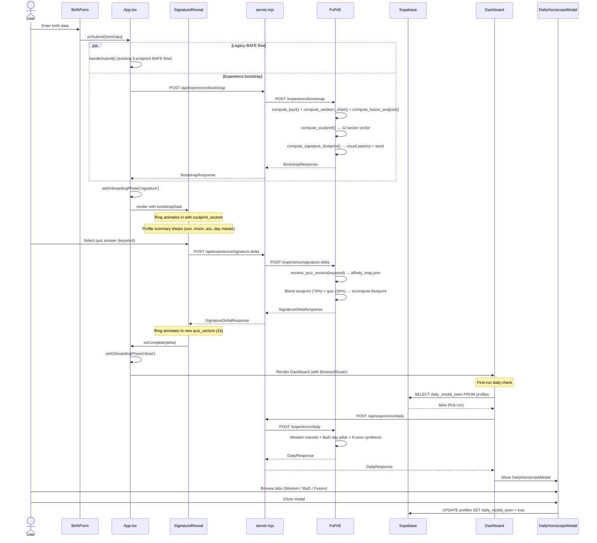

# Experience Feature Architecture

## User Journey



## Data Flow Diagram

```
                                    ┌─────────────────┐
                                    │    FuFirE API    │
                                    │  /experience/*   │
                                    └────────▲────────┘
                                             │
                              ┌──────────────┼──────────────┐
                              │         server.mjs          │
                              │    Experience Proxy Layer    │
                              │                             │
                              │  /api/experience/bootstrap  │
                              │  /api/experience/sig-delta  │
                              │  /api/experience/daily      │
                              │                             │
                              │  - 10KB payload limit       │
                              │  - 10-20s timeouts          │
                              │  - 502 on FuFirE failure    │
                              └──────────────▲──────────────┘
                                             │
               ┌─────────────────────────────┼─────────────────────────────┐
               │                             │                             │
    ┌──────────┴──────────┐    ┌─────────────┴────────────┐    ┌──────────┴──────────┐
    │ bootstrapExperience │    │    signatureDelta()       │    │ fetchDailyExperience│
    │   (experience.ts)   │    │    (experience.ts)        │    │   (experience.ts)   │
    └──────────▲──────────┘    └─────────────▲────────────┘    └──────────▲──────────┘
               │                             │                             │
    ┌──────────┴──────────┐    ┌─────────────┴────────────┐    ┌──────────┴──────────┐
    │    App.tsx           │    │   SignatureReveal.tsx     │    │  useFirstRunDaily   │
    │  handleOnboarding   │    │  handleQuizAnswer()       │    │   (hook)            │
    │  Submit()           │    │                           │    │                     │
    └─────────────────────┘    └──────────────────────────┘    └──────────┬──────────┘
                                                                          │
                                                               ┌──────────┴──────────┐
                                                               │ DailyHoroscopeModal │
                                                               │  (3-tab UI)         │
                                                               └─────────────────────┘

    Supabase Persistence:
    ┌─────────────────────────────────────────────────────────────────────────────────┐
    │  user_signature_state   │ soulprint, blueprint, quiz_sectors per user          │
    │  daily_horoscope_cache  │ daily payload keyed by (user, date, engine, sig ver) │
    │  profiles               │ + daily_modal_seen column (boolean)                  │
    │  astro_profiles         │ + soulprint_sectors column (JSONB)                   │
    └─────────────────────────────────────────────────────────────────────────────────┘
```

## Component Hierarchy

```
App.tsx
├── Splash
├── AuthGate
├── Onboarding (showOnboarding && phase !== 'done')
│   ├── BirthForm                   (onboardingPhase === 'form')
│   │   └── calls handleOnboardingSubmit()
│   │       ├── handleSubmit()           — legacy BAFE 5-endpoint flow
│   │       └── bootstrapExperience()    — Experience API (if feature flag on)
│   └── SignatureReveal             (onboardingPhase === 'signature')
│       ├── FusionRingWebsiteCanvas     — canvas ring driven by activeSectors
│       ├── ProfileSummary              — sun, moon, ascendant, day master, harmony
│       └── QuizOptions                 — 4 keyword buttons
│           └── calls signatureDelta()  → updates activeSectors → ring animates
│               └── onComplete()        → setOnboardingPhase('done')
│
└── Authenticated App (BrowserRouter)
    └── AppShell
        └── AppRoutes
            └── DashboardPage
                ├── useFirstRunDaily(userId, birthData, soulprintSectors, quizSectors)
                │   ├── checks profiles.daily_modal_seen
                │   ├── checks localStorage cache
                │   └── calls fetchDailyExperience()
                └── DailyHoroscopeModal (if showModal)
                    ├── Tab: Westlich (SectionContent)
                    ├── Tab: BaZi (SectionContent)
                    └── Tab: Fusion (FusionContent)
```

## Service Dependencies

### FuFirE services called by `/experience/bootstrap`

```
bootstrap(BirthInput)
    │
    ├── compute_bazi(BaziInput)
    │   └── Returns: pillars (year/month/day/hour stems+branches), day_master
    │
    ├── compute_western_chart(birth_utc_dt, lat, lon)
    │   └── Returns: bodies (Sun, Moon, Mercury, Venus, Mars positions), ascendant
    │
    ├── compute_fusion_analysis(birth_utc, lat, lon, bazi_pillars, western_bodies, ascendant)
    │   └── Returns: wu_xing_vectors, harmony_index, calibration
    │
    ├── compute_soulprint(sun_idx, moon_idx, asc_idx, personal_planets, wuxing_vector)
    │   └── Returns: float[12] normalized sector vector
    │   └── Algorithm:
    │       - Sun sign sector += 1.0
    │       - Moon sign sector += 0.8
    │       - Ascendant sector += 0.6
    │       - Mercury/Venus/Mars sectors += 0.4 each
    │       - Wu-Xing element affinities += weight * 0.5
    │       - Normalize to sum = 1.0
    │
    └── compute_signature_blueprint(soulprint, wuxing_vector, harmony_index)
        └── Returns: seed (SHA-256 hash), visual params, elements
        └── All parameters are deterministic functions of input
```

### FuFirE services called by `/experience/signature-delta`

```
signature_delta(soulprint, blueprint, keyword)
    │
    ├── resolve_quiz_sectors(keyword)
    │   └── Loads affinity_map.json → keyword → float[12]
    │   └── Unknown keywords → uniform [1/12, ...]
    │
    ├── Blend: blended[i] = soulprint[i] * 0.7 + quiz[i] * 0.3
    │   └── Normalize to sum = 1.0
    │
    └── compute_signature_blueprint(blended, wuxing, harmony=0.5)
        └── Returns new blueprint + visual deltas vs. old blueprint
```

### FuFirE services called by `/experience/daily`

```
daily(birth, soulprint, quiz_sectors, target_date)
    │
    ├── _compute_astro_profile(birth)  [recomputes natal chart]
    │
    ├── generate_western_daily(sun_idx, moon_idx, asc_idx, soulprint, date, tz, lat, lon)
    │   ├── compute_transit_now(target_noon_utc) → sector_intensity[12]
    │   ├── combined[i] = transit[i] * soulprint[i]
    │   └── Top-2 sectors → themes, summary, caution, opportunity
    │
    ├── generate_eastern_daily(day_master, target_date, tz)
    │   ├── sexagenary_day_index_from_date() → day pillar stem + branch
    │   ├── _determine_relation(natal_element, daily_element)
    │   │   └── companion | resource | output | power | wealth | neutral
    │   └── Themed summary based on relation type
    │
    └── generate_fusion_daily(western, eastern)
        ├── _find_shared_themes(w_themes, e_themes)
        │   └── Exact match → affinity match → fallback
        ├── Synthesis of shared + tension themes
        └── pushworthy = relation in (power, wealth, resource)
```

## Supabase Schema

### New Tables

#### `user_signature_state`

Persists the user's signature state across sessions. One row per user.

| Column | Type | Description |
|--------|------|-------------|
| `user_id` | `UUID` (PK, FK → auth.users) | User reference |
| `signature_blueprint_json` | `JSONB` | Full SignatureBlueprint object |
| `soulprint_sectors` | `JSONB` | 12-element float array |
| `quiz_sectors` | `JSONB` | Quiz-derived sectors (default: empty array) |
| `quiz_version` | `INTEGER` | Incremented on each quiz interaction (default: 0) |
| `signature_version` | `INTEGER` | Blueprint version counter (default: 1) |
| `updated_at` | `TIMESTAMPTZ` | Last update timestamp |

RLS: Users can only manage their own row.

#### `daily_horoscope_cache`

Server-side cache for daily horoscope payloads. Composite primary key ensures one entry per user/date/engine-version/signature-version combination.

| Column | Type | Description |
|--------|------|-------------|
| `user_id` | `UUID` (FK → auth.users) | User reference |
| `local_date` | `DATE` | Horoscope date |
| `engine_version` | `TEXT` | FuFirE engine version at generation time |
| `signature_version` | `INTEGER` | Signature version at generation time (default: 1) |
| `payload_json` | `JSONB` | Full DailyResponse payload |
| `generated_at` | `TIMESTAMPTZ` | Generation timestamp |

PK: `(user_id, local_date, engine_version, signature_version)`. RLS: Users can read their own cache entries.

### Modified Tables

#### `astro_profiles`

Added column:

| Column | Type | Description |
|--------|------|-------------|
| `soulprint_sectors` | `JSONB` | 12-sector soulprint vector (nullable, populated on bootstrap) |

#### `profiles`

Added column:

| Column | Type | Description |
|--------|------|-------------|
| `daily_modal_seen` | `BOOLEAN` | Whether the user has dismissed the daily horoscope modal. Default: `false`. Set to `true` on modal close (fire-and-forget). |

### Migration

File: `supabase-migrations/20260316_experience_tables.sql`

## Feature Flags

Two client-side feature flags in `src/lib/feature-flags.ts`:

| Flag | Default | Controls |
|------|---------|----------|
| `signature_onboarding_v1` | `true` | Whether `App.tsx` calls `bootstrapExperience()` and shows the `SignatureReveal` phase. When `false`, the app skips directly to Dashboard after BAFE completes. |
| `daily_modal_v1` | `true` | Whether `useFirstRunDaily` fetches and displays the `DailyHoroscopeModal`. |

**Override pattern:** Flags check `localStorage` for `ff_{flag_name}`. A stored value of `"true"` or `"false"` overrides the hardcoded default. Removing the key restores the default.

```javascript
// Disable in browser console
localStorage.setItem('ff_signature_onboarding_v1', 'false');
// Re-enable
localStorage.removeItem('ff_signature_onboarding_v1');
```

**Fallback behavior:** When a feature flag is off or the Experience API fails, the app gracefully falls through to the existing BAFE-only flow. The bootstrap call is non-blocking relative to the legacy BAFE flow -- both run in parallel, and if bootstrap fails, the user sees the normal Dashboard without the Signatur onboarding step.

## Deployment Order

1. **Deploy FuFirE** with the `experience` router (`routers/experience.py`) and supporting services (`services/soulprint.py`, `services/signature_blueprint.py`, `services/daily_western.py`, `services/daily_eastern.py`, `services/daily_fusion.py`, `services/quiz_affinity.py`). Ensure `data/affinity_map.json` is present.
2. **Apply Supabase migration** `supabase-migrations/20260316_experience_tables.sql` -- creates `user_signature_state`, `daily_horoscope_cache`, adds columns to `astro_profiles` and `profiles`.
3. **Deploy Astro-Noctum** with the updated `App.tsx`, new components (`SignatureReveal`, `DailyHoroscopeModal`), hooks (`useFirstRunDaily`), services (`experience.ts`), schemas (`experience.ts`), and feature flags (`feature-flags.ts`). The `server.mjs` proxy routes must also be deployed.

**Rollback:** Set feature flags to `false` via environment config or instruct users to override via localStorage. No database rollback needed -- new tables and columns are additive.

## Error Handling Strategy

| Layer | Failure Mode | Behavior |
|-------|-------------|----------|
| `App.tsx` bootstrap | FuFirE unreachable or 5xx | `catch` logs error, phase stays `form`, user continues with legacy BAFE flow |
| `SignatureReveal` delta | FuFirE unreachable or 5xx | Shows "Etwas ist schiefgelaufen", auto-completes after 3s, user proceeds to Dashboard |
| `useFirstRunDaily` | Any fetch error | Silently fails, modal not shown -- daily is non-critical |
| `server.mjs` proxy | Timeout (10-20s) | Returns 502 `experience_unavailable` |
| FuFirE computation | Invalid birth data | Returns 422 with descriptive error |
| Zod parse (client) | Unexpected response shape | Throws, caught by calling component's error handler |
