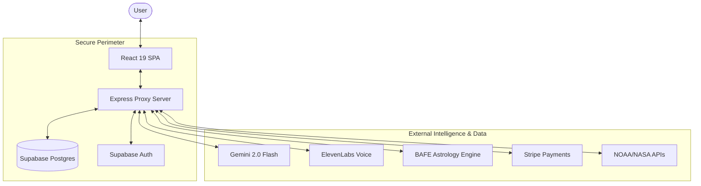
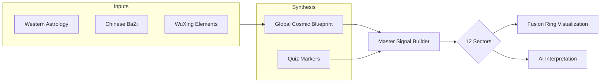
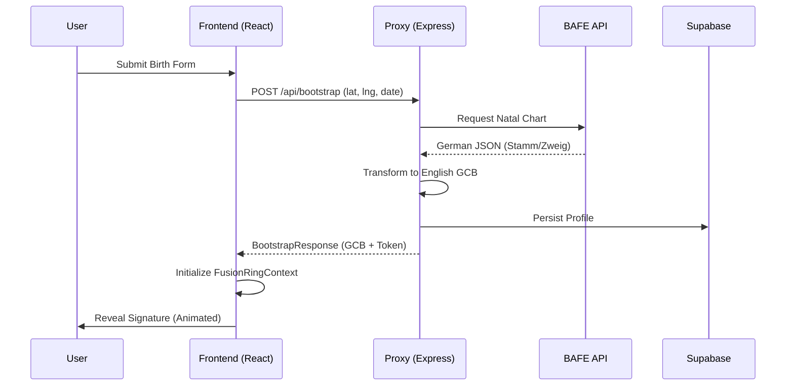

# Astro-Noctum (Bazodiac) — Technical Architecture & User Logic

## 1. Executive Summary

Astro-Noctum (internally referred to as Bazodiac) is a high-end, fusion-astrology platform that bridges Western Astrology, Chinese BaZi (Four Pillars of Destiny), and Wu-Xing (Five Elements). The system transforms complex astronomical and metaphysical data into high-fidelity visual energy signatures and AI-driven personalized insights.

### Core Philosophy
The platform operates on the principle of **Multi-System Resonance**. By fusing three distinct astrological traditions, it creates a "Master Signal" that provides deeper psychological and energetic insights than any single system could offer alone.

---

## 2. System Architecture

Astro-Noctum is built with a multi-layered, secure architecture designed for high-performance visualizations and real-time AI interactions.

### 2.1 Architecture Overview

### 2.2 Technology Stack
- **Frontend**: React 19 SPA, TypeScript, Vite 6, Tailwind CSS v4.
- **Backend Proxy**: Express.js (serving as a secure gateway for upstream APIs).
- **Data & Auth**: Supabase (PostgreSQL + Auth).
- **AI Engine**: Gemini 2.0 Flash (via server-side Google GenAI SDK).
- **Voice Engine**: ElevenLabs (Real-time voice synthesis and agent tools).
- **Astrology Engine**: BAFE API (Upstream complex calculations).

### 2.3 Frontend Layer
The frontend is designed as a "Depth-Navigation" SPA. Instead of traditional flat routing, it uses a hierarchical navigation model where users move "Inward" (detail) or "Outward" (overview).

#### Key Contexts:
- `AuthContext`: Manages user session via Supabase.
- `FusionRingContext`: Orchestrates the complex weights and sector signals of the user's energy profile.
- `AgentContext`: Controls the state of the AI Voice Agents (Levi & Eve).
- `PlanetariumContext`: Manages the 3D state of the planetary orrery.

---

## 3. Core Domain Logic

The heart of Bazodiac is its mathematical and semantic engine.

### 3.1 The Master Signal System
The system translates metaphysical data into numeric weights across **12 sectors** (mapping roughly to zodiac/house archetypes).

### 3.2 Signal Fusion
- **Natal Projection**: Birth data forms the baseline "Soulprint".
- **Quiz Projection**: User inputs from interactive quizzes add "dynamic signals".
- **Mathematical Smoothing**: Uses circular mathematics and Gaussian Bell curves to ensure energy transitions between sectors are visually and energetically coherent.

### 3.3 LeanDeep Framework
This is a proprietary semantic mapping layer.
- **Markers**: Dialogue is analyzed for psychological markers (e.g., `marker.emotion.security`, `marker.freedom.independence`).
- **Resonance**: The system calculates "Compatibility Resonance" by comparing the marker overlap between two user profiles.

---

## 4. User Flow & Logic

### 4.1 Onboarding Sequence
The onboarding flow is a synchronized dance between data capture and narrative storytelling.

### 4.2 Lifecycle Phases
1.  **Phase 1: Onboarding**: Birth Form -> Cosmic Encounter (Levi) -> Signature Reveal.
2.  **Phase 2: Dashboard**: The central hub for daily insights, 3D solar status, and AI horoscopes.
3.  **Phase 3: Deep Dives**: Detailed analysis in Wu-Xing, Fu-Ring, and Sky hubs.

---

## 5. Feature Deep-Dives

### 5.1 AI Voice Agents (Levi & Eve)
- **Personality**: Driven by Gemini 2.0 Flash prompts.
- **Synthesis**: Real-time emotional voice delivery via ElevenLabs.
- **Memory**: Conversations are summarized to build a persistent "Long-term User Profile".

### 5.2 Fusion Ring Visualization
- **Rendering**: Hybrid 2D Canvas and Three.js layers.
- **Dynamic Interaction**: The ring pulses and shifts as the user completes quizzes or as cosmic transits change.

### 5.3 Space Weather Integration
- **Cosmic Dissonance**: Solar activity from NOAA/NASA is mapped to the user's specific sector weights to highlight daily energetic challenges.

---

## 6. Monetization & Infrastructure

### 6.1 Stripe Lifecycle
- `/api/checkout`: Generates hosted payment sessions.
- `/api/webhook/stripe`: Synchronizes user tiers across `profiles` and `astro_profiles` tables.

### 6.2 Infrastructure
- **Environment**: Node.js 20.19+ on Railway.
- **Testing**: Vitest suite covering BAFE-to-GCB mapping and Signal synthesis.
