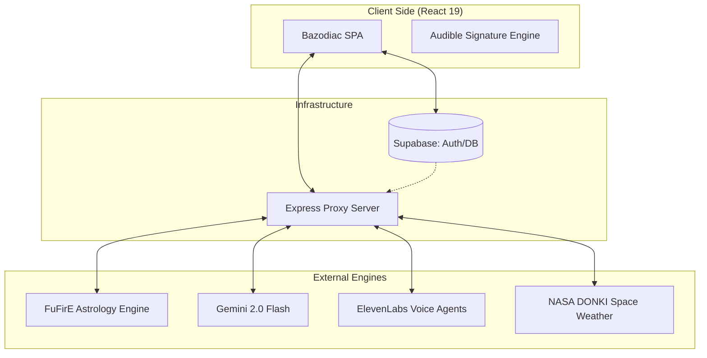
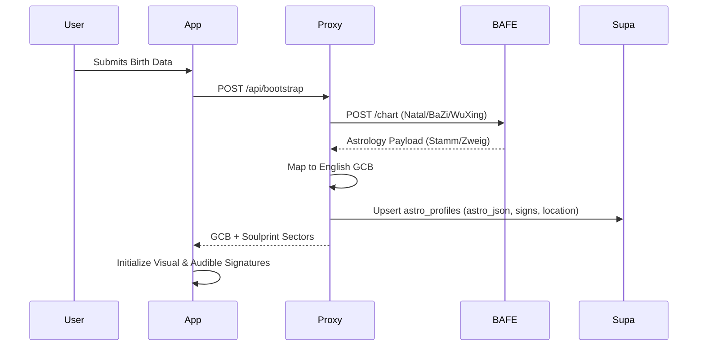
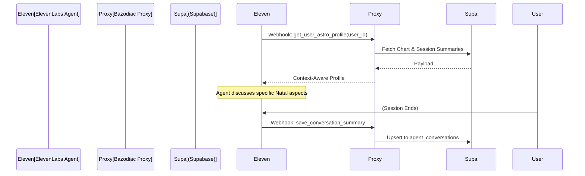

# Astro-Noctum (Bazodiac) Service Architecture & Integrated Systems

This document details the integrated service landscape of Astro-Noctum (Bazodiac), describing how the application, database, and external astrological and AI engines work together to produce a coherent, multi-sensory user experience.

## 1. System Landscape

Bazodiac uses a **Hybrid Architecture** designed for security, high-precision math, and emotional resonance.
- **Client-Direct**: High-frequency data and Auth go directly between the App and Supabase.
- **Proxy-Gateway**: Sensitive calculations (BAFE) and AI interactions (ElevenLabs/Gemini) are routed through a secure Express proxy server.
- **Integrated Outputs**: The system synthesizes data into three primary dimensions: **Visual** (Fusion Ring), **Audible** (Signature Melody), and **Analytic** (Coherence Index).

---

## 2. Component Roles

### 2.1 Bazodiac (Frontend)
The primary interface, managing:
- **State Orchestration**: The `FusionRingContext` calculates the "Master Signal" by fusing Natal (BAFE), Transit (BAFE), and Quiz (User) weights.
- **Audible Signature**: Uses the `useCoustoAudio` hook to transform planetary frequencies and BaZi stems into personalized melodies.

### 2.2 Supabase (Core Data Hub)
The single source of truth for:
- **Profiles & Charts**: Stores the `astro_json` payload and `soulprint_sectors`.
- **Coherence State**: Tracks the `kohaerenz_index` (0–1) and its constituent layers.
- **Agent Memory**: Persists summaries and topic tags from voice interactions.

### 2.3 FuFirE / BAFE API
The heavy-lifting astrological engine:
- **Onboarding (Stage 1 Direct)**: On submission of birth data, the Proxy calls `/chart` directly, bypassing legacy webhooks to ensure immediate, atomic profile creation.

### 2.4 Intelligence & Synthesis Layer
- **Gemini 2.0 Flash**: Handles linguistic interpretation and profile auto-synthesis.
- **ElevenLabs**: Powers real-time voice agents Levi (BaZi expert) and Eve (Western specialist).

---

## 3. Core Interaction Flows

### 3.1 Onboarding & "Superglue-Free" Bootstrap
The system ensures data integrity by performing atomic "Fetch & Persist" operations on the server side.

### 3.2 The Coherence Index Engine
The Coherence Index (0–1) expresses how strongly the user's structure resonates at a given moment.

| Layer | Source | Formula Contribution |
| :--- | :--- | :--- |
| **Natal Core** | BAFE Bootstrap | Baseline (1.0 weight) |
| **Transit Layer** | BAFE Daily | $\alpha = 0.40$ (Semantic modulator) |
| **Quiz Calibration** | User Contribution | $\beta = 0.20$ (Dynamic refinement) |
| **Membrane Layer** | NASA DONKI | $\gamma = 0.15$ (Amplitude multiplier) |

**Formula**:  
$Kohaerenz = \text{clamp}((Natal + Transit + Quiz) \times (1 + \gamma \times MembraneGain), 0, 1)$

### 3.3 Audible Signature Pipeline (The Sound of the Day)
The user's signature is made audible as a personalized, daily-shifting composition.
1. **Natal Base**: Day Master Stem determines the musical key (e.g., Wood = Ionian, Fire = Mixolydian).
2. **Transit Soli**: The three most active transits become melodic lines.
3. **Space Weather**: K-Index modulation determines reverb, filter sweeps, and "friction".
4. **Quiz Phrases**: Recent contributions are woven in as rhythmic highlights.

---

## 4. Voice Agent Intelligence Loop

Bazodiac Voice Agents (Levi & Eve) utilize a server-side tool-calling loop for deep personalization.

---

## 5. Linguistic Identity & Brand Voice

The system's output is governed by strict tonal guardrails defined in the **Brand Voice Guide**:
- **Personality**: "An astrophysicist who lays Tarot at night."
- **Precision**: We use specific degrees and terms (e.g., "17° Libra") rather than generic fluff.
- **Warmth without Softness**: Direct and inviting, but never "casual" or "missionary".
- **Terminology**: We use "Signature" instead of "Profile", and "Contribution" instead of "Input".

---

## 6. Security & Data Model

### 6.1 JWT Propagation
All Proxy calls are validated via Supabase JWT. The server uses the `userId` to enforce RLS (Row Level Security), ensuring birth data is only visible to its owner.

### 6.2 Critical Tables
- `astro_profiles`: The primary storage for BAFE payloads (`astro_json`) and sector weights.
- `user_signature_state`: Tracks the real-time `kohaerenz_index` and `quiz_sectors`.
- `space_weather_cache`: Hourly snapshots of NASA DONKI data used for membrane gain.

---
*Created by Docs Architect Agent — 2026-04-18*
